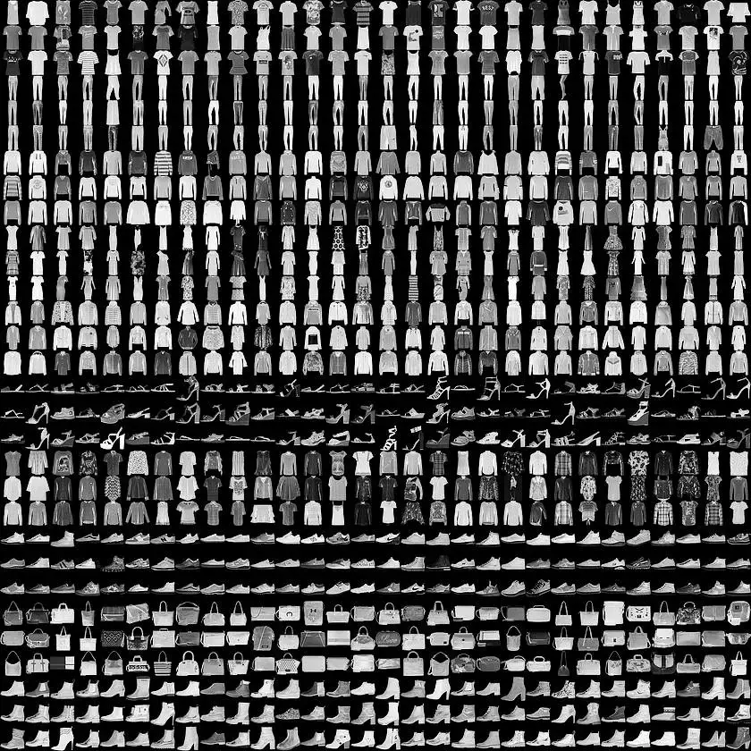

## 一、问题定义
在本项目中，我们研究的任务是**基于 FashionMNIST 数据集的图像分类问题**。该问题属于**监督学习（Supervised Learning）中的图像分类任务**，其目标是训练一个模型，使其能够根据输入的图像像素信息，准确预测该图像所对应的服饰类别。

  
<center style="font-size: 10px;">图1: FashionMNIST数据集的10个类别示例。</center>  
&nbsp

FashionMNIST数据集，如图1所示，是由Zalando提供的公开图像数据集，旨在作为经典MNIST手写数字数据集的替代品，以推动计算机视觉领域在更贴近实际场景的图像任务上的研究。该数据集包含 10 个不同类别的服饰图像，分别为：  
1. T-shirt/top（T恤）  
2. Trouser（裤子）  
3. Pullover（套头衫）  
4. Dress（裙子）  
5. Coat（外套）  
6. Sandal（凉鞋）  
7. Shirt（衬衫）  
8. Sneaker（运动鞋）  
9. Bag（包）  
10. Ankle boot（短靴）  

每张图像为灰度图（单通道），尺寸为 28×28 像素，训练集包含 60,000 张图像，测试集包含 10,000 张图像（与原始的 MNIST 完全一致）。

从机器学习角度来看，该问题的核心是学习一个多分类模型，其形式化定义如下：  
- **输入空间（Input Space）**：一张 28×28 的灰度图像，可表示为 784 维向量。  
- **输出空间（Output Space）**：10 个离散类别中的一个，表示预测的服饰种类。  
- **学习目标**：通过对训练数据的学习，构建一个映射函数 \( f: \mathbb{R}^{784} \rightarrow \{0, 1, ..., 9\} \)，使得该函数在未见过的数据上具有良好的泛化能力。

本项目的挑战在于图像中存在的**类别间相似性**（如T-shirt与Shirt，运动鞋和短靴）、**像素级信息的表达能力有限**，以及如何设计和优化模型以提升分类准确率。因此，我们不仅要选择合适的模型结构（如MLP，CNN或者ResNet），还需考虑数据增强、训练策略、损失函数、优化方法等多方面因素。

## 二、数据分析及处理
### 数据分析

<div style="display: flex; justify-content: center; gap: 20px;">
    <div style="width: 45%;">
        
        <center style="font-size: 10px;">图2: 主成分分析可视化结果。</center>
    </div>
    <div style="width: 45%;">
        
        <center style="font-size: 10px;">图3: t-SNE分析可视化结果。</center>
    </div>
</div>
&nbsp

为了更好地理解 FashionMNIST 数据集的结构特征，我们参考了官网提供的主成分分析(PCA)与t-分布随机邻域嵌入（t-SNE）的可视化结果。  
这些降维方法能够将高维图像数据（784 维）映射到低维空间上，从而便于我们观察不同类别在特征空间中的分布情况。

#### 1. PCA可视化（如图2所示）

主成分分析是一种常见的线性降维方法，通过提取数据中的主方向（主成分）来尽可能保留原始数据的方差。PCA 可视化图展示了不同服饰类别在前两个主成分坐标轴下的投影情况。

从 PCA 图中可以观察到：

- 某些类别（如 Sandal、Sneaker、Ankle Boot）在投影空间中具有较为明显的聚类趋势，说明它们的图像在原始高维空间中也具有一定的可区分性。
- 然而，一些类别（如 T-shirt/top与Shirt）在 PCA 空间中存在重叠，反映出它们的图像在像素层面相似度较高，给模型的分类任务带来了挑战。

#### 2. t-SNE可视化（如图3所示）

t-SNE是一种非线性降维技术，特别适用于高维数据的可视化。它通过保持高维空间中邻近样本之间的相似性，将数据映射到二维或三维空间，从而揭示出潜在的簇结构。

从 t-SNE 图中可以观察到：

- 数据集中的大多数类别在二维空间中表现出更清晰的聚类效果，相较于 PCA，类别间的边界更加明显。
- 类别如 Trouser 和 Bag 等显示出紧密聚类，说明其图像特征在高维空间中有良好的可分性。但仍然可以看到 T-shirt/top、Shirt 和 Pullover 等类别之间存在重叠现象。

### 数据处理
#### 基础数据处理
本项目中使用的数据处理流程主要借助`torchvision.transforms`模块完成，主要代码如下：
```python
transform = transforms.Compose([
        transforms.RandomCrop(28, padding=4),
        transforms.RandomHorizontalFlip(),
        transforms.ToTensor(),
        transforms.Normalize((0.5,), (0.5,))
    ])
```

**各步骤说明**：
  
<center style="font-size: 10px;">图4:数据处理过程展示</center> 
&nbsp

1. **`RandomCrop(28, padding=4)`**  
   此操作首先在每张图像四周填充 4 个像素（采用 0 填充），然后随机裁剪出一张尺寸为 28×28 的图像。如图4所示，第一个“→”表示了裁剪的过程。

2. **`RandomHorizontalFlip()`**  
   该操作以 50% 的概率将图像沿水平方向翻转，增强了数据的多样性。如图4所示，第二个“→”表示了水平翻转的过程。

3. **`ToTensor()`**  
   由于本项目采用pytorch框架，故这里需要将输入图像从 PIL 格式或 NumPy 数组转换为 PyTorch 的张量格式（Tensor），并自动将像素值从 0~255 缩放到 0~1 之间

4. **`Normalize((0.5,), (0.5,))`**  
   对图像进行标准化处理，即将像素值按如下公式进行线性变换，将原始像素值（已缩放到 [0, 1]）进一步映射到 [-1, 1] 区间，帮助模型更快收敛并提升稳定性。

#### 进一步的数据处理
可以考虑使用旋转，改变图像亮度等操作对图像进行进一步处理。  
但在实验后发现，太多过于复杂的数据处理可能未必带来模型性能的增益，甚至可能会导致模型性能轻微的下降。

## 三、模型构建

在深度学习中，模型架构的选择对最终性能具有决定性影响。本项目采用**渐进式**的建模策略，首先通过简单的**多层感知机**验证基础流程，随后引入**深度残差网络**以充分捕捉图像的空间特征，实现分类性能的显著提升。

#### 1. MLP基础验证

为确保数据处理流程和训练机制的可靠性，首先实现了一个三层的MLP模型。该模型以展平的28×28灰度图像（784维特征）作为输入，经过一个隐藏层（维度分别为128）后输出10维分类结果。隐藏层采用ReLU激活函数。

实验表明，该MLP模型在测试集上达到85.1%的准确率，成功验证了training pipeline的有效性。虽然这样的准确率已经不低，但受限于全连接结构的特性，模型难以有效捕捉图像局部特征，故而还有比较大的提升空间。

#### 2. ResNet18特征学习
为了尽可能提升分类准确率，最终选择了ResNet18这一经典的深度卷积网络。其创新性的残差连接设计通过跨层恒等映射，有效解决了深层网络的梯度衰减问题。
本项目的实现参考了pytorch的专业的高质量实现，同时针对FashionMNIST数据集的28×28灰度图像特点，对标准ResNet18进行了适配性修改。以下从核心组件、层级结构和数据流三个维度进行详细说明：

**1. 核心组件设计**   
   (1) 初始卷积块
   ```python
   self.conv1 = nn.Conv2d(1, 64, kernel_size=3, stride=1, padding=1, bias=False)
   self.bn1 = nn.BatchNorm2d(64)
   ```
   - 输入适配：将标准ResNet的7×7卷积改为3×3卷积，保持28×28分辨率（stride=1, padding=1）
   - 通道扩展：从单通道灰度图映射到64维特征空间
   - 批归一化：加速收敛并稳定训练过程

   (2) 残差块
   每个BasicBlock包含两个3×3卷积层，其结构如下：
   ```python
   class BasicBlock(nn.Module):
      expansion = 1  # 通道扩展系数
      def __init__(self, in_channels, out_channels, stride=1):
         super().__init__()
         self.conv1 = nn.Conv2d(in_channels, out_channels, 3, stride, 1, bias=False)
         self.bn1 = nn.BatchNorm2d(out_channels)
         self.conv2 = nn.Conv2d(out_channels, out_channels, 3, 1, 1, bias=False)
         self.bn2 = nn.BatchNorm2d(out_channels)
         
         self.shortcut = nn.Sequential()
         if stride != 1 or in_channels != out_channels * self.expansion: # 维度不匹配
               self.shortcut = nn.Sequential(
                  nn.Conv2d(in_channels, out_channels*self.expansion, 1, stride, bias=False),
                  nn.BatchNorm2d(out_channels*self.expansion)
               )
   ```
   - 残差连接：当输入输出维度不匹配时，通过1×1卷积调整维度
   - 恒等映射：满足条件时直接传递输入

**2. 层级结构**
通过`_make_layer`方法构建4个残差阶段：
```python
def _make_layer(self, block, out_channels, num_blocks, stride):
    strides = [stride] + [1]*(num_blocks-1)  # 只有第一个block可能降采样
    layers = []
    for stride in strides:
        layers.append(block(self.in_channels, out_channels, stride))
        self.in_channels = out_channels * block.expansion
    return nn.Sequential(*layers)
```

| 层级   | 输出尺寸    | 组成规则                          | 特征变化                |
|--------|-------------|-----------------------------------|-------------------------|
| conv1  | 64×28×28    | 3×3卷积，stride=1                 | 灰度→64维特征           |
| layer1 | 64×28×28    | 2×BasicBlock(stride=1)            | 保持分辨率              |
| layer2 | 128×14×14   | 2×BasicBlock(首个stride=2)        | 通道加倍，空间减半      |
| layer3 | 256×7×7     | 2×BasicBlock(首个stride=2)        | 通道加倍，空间减半      |
| layer4 | 512×4×4     | 2×BasicBlock(首个stride=2)        | 最终输出512维特征       |

最后，通过平均池化层，随机dropout和一个全连接层得到当前图输入分别属于十个类别的概率。代码实现如下：
```python
out = out.view(out.size(0), -1)        # [B,512]
out = self.dropout(out)                # 正则化
out = self.fc(out)                     # [B,num_classes]
```


**3. 关键设计特点**
* **小卷积核优势**：
   - 全部采用3×3卷积，相比原始ResNet的7×7初始卷积更适应小尺寸图像
   - 参数量减少

* **降采样策略**：
   - 仅在layer2-4的第一个残差块进行stride=2降采样
   - 通过卷积而非池化保留空间信息

* **正则化设计**：
   - 批归一化：每个卷积层后接BN层
   - Dropout：全连接前使用0.3概率的dropout防止过拟合

总而言之，经过调整后的ResNet18在测试集上取得了95.0%的准确率，较MLP提升近10个百分点。

#### 3. 模型性能对比

下表展示了两种模型的性能对比：

| 模型类型 | 参数量 | 推理速度(ms) | 测试集准确率 |
|---------|--------|-------------| ------------|
| MLP     | 1.2M   | 0.8         | 85.1%      |
| ResNet18| 11.2M  | 3.2         | 95.0%      |
| ResNet34| 21.8M  | 1.6         | 94.9%      |

通过对比可以发现，深度残差网络的卷积结构的局部感知特性显著提升特征提取能力，其残差设计也有助于提升模型性能。

## 四、训练过程
本项目采用PyTorch框架实现模型训练。整个训练流程包括**数据预处理、模型构建、训练与验证、测试评估**四个步骤，并通过**日志**与**TensorBoard** 记录训练过程中的关键指标。具体流程如下：

1. 首先，对 FashionMNIST 数据集进行了增强与划分，将原始训练集按 8:2 的比例划分为训练集与验证集。数据增强操作包括随机裁剪、水平翻转，以提高模型泛化能力。

2. 在模型训练阶段，使用 ResNet18 结构作为主干网络，并采用 Adam 优化器与交叉熵损失函数进行优化。训练过程中引入了余弦退火学习率调度策略以进一步提升性能。每轮训练结束后，均在验证集上评估模型性能，并记录准确率与损失值。

3. 训练完成后，在测试集上评估模型最终效果，并将模型权重与训练配置保存至指定目录，便于后续复现与部署。最终训练得到的模型在测试集上取得了 94.96% 的准确率，验证了训练流程的有效性与模型的良好性能。


## 五、实验结果与分析
### 训练过程分析

<center style="font-size: 10px;">图5:loss曲线</center> 
从图5的loss曲线可以看出，对于FashionMNIST数据集，ResNet18和ResNet34在相同步数下loss几乎是相同的；如果仔细分辨，则是ResNet34凭借其较大的深度，在loss上表现略优于ResNet18。最终，在大概50000步后，二者都收敛于十分接近于0的值。  


<center style="font-size: 10px;">图6:accuracy曲线</center> 
&nbsp
*注：由于MLP仅用于测试training pipeline的正确性，故没有等待其完全收敛  
&nbsp    

从图6的accuracy曲线可以看出，在训练过程中，ResNet34在验证集上的准确率比ResNet18略高，甚至有某几次超过95%，这表明ResNet34的拟合能力高于ResNet18。但是，由于ResNet在该数据集上的性能已经接近饱和，而且可能也因为对于该测试集而言ResNet34参数量过大，导致最终在测试集上ResNet18(94.97%)表现略好于ResNet34(94.87%)。  
另外，也可以看出，ResNet的拟合能力远强于MLP。

### 错误预测结果分析
以下分析以实验中表现最好的ResNet18为例。

<center style="font-size: 10px;">图7:每个真实标签错误预测情况分解。以第一列为例，它表示对于真实标签为0的图片，被错误预测为其它类别的情况；如，它如果被预测错误，则大概率被预测为6号标签，也可能被预测为2、3、8号标签。</center>   

由图7可以直观看出，类别6（衬衫）被错误预测为其它类别的概率最高，而其它类别也最容易被错误预测为类别6。其中，类别0（T恤），2（套头衫），3（裙子），4（外套）都有较大概率被错误预测为类别6，这可能是因为这些衣服本身的确在外形上比较相似，在仅有一张黑白图片为判断依据的前提下，可能人类也难以准确判断。

<div style="display: grid; grid-template-columns: repeat(4, 1fr); gap: 10px;">
  
  
  
  
</div>
<center style="font-size: 10px;">图8:被错误预测为衬衫的Tshirt</center>

<div style="display: grid; grid-template-columns: repeat(4, 1fr); gap: 10px;">
  
  
  
  
</div>
<center style="font-size: 10px;">图8:被错误预测为Tshirt的衬衫</center>

由图7图8可以看出，Tshirt和shirt的确非常相似，这可能会迷惑模型，使其容易在这些类别的预测上出错。相比之下，类别1（裤子）和类别8（包）由于在外形上于其它类别区别较大，因此预测的正确率就相对较高。

## 六、评价
官网给出的各个模型的最好表现

